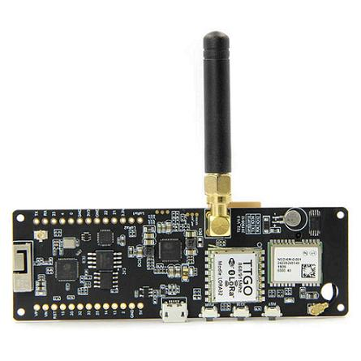
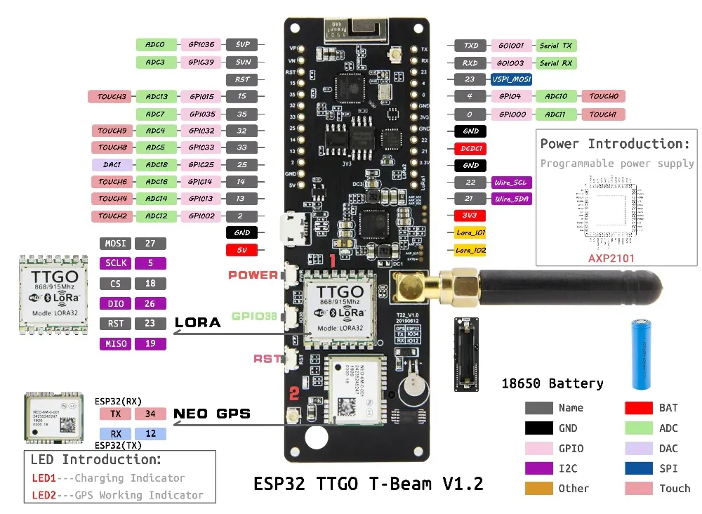

# TBeam v1.2

El TBeam 1.2 es un dispositivo de desarrollo basado en el microcontrolador ESP32, que se ha diseñado para aplicaciones de Internet de las Cosas (IoT) y comunicaciones de larga distancia. Este módulo combina múltiples funcionalidades, incluyendo conectividad LoRa, GPS y capacidades de conexión Wi-Fi, lo que lo hace ideal para proyectos que requieren la transmisión de datos a largas distancias y la localización precisa.

### Características principales:

1. **Conectividad LoRa**: Utiliza la tecnología LoRa (Long Range) para la comunicación a distancias que pueden superar varios kilómetros, dependiendo del entorno. Esto permite la transmisión de datos de manera eficiente y de bajo consumo energético. Cabe destacar que en España, la frecuencia permitida es de 868MHz.
    
2. **GPS Integrado**: El TBeam 1.2 cuenta con un receptor GPS, lo que permite determinar su posición geográfica exacta. Esto es crucial para aplicaciones de seguimiento y monitoreo de ubicación en tiempo real.
    
3. **Microcontrolador ESP32**: Equipado con el potente microcontrolador ESP32, el TBeam ofrece capacidades de procesamiento avanzadas, conectividad Wi-Fi y Bluetooth, lo que le permite integrarse fácilmente con otros dispositivos y servicios en la nube.
    
4. **Alimentación de bajo consumo**: Diseñado para aplicaciones de larga duración, el TBeam puede operar con fuentes de energía de bajo consumo, lo que lo convierte en una opción atractiva para proyectos que requieren autonomía prolongada.
    
5. **Diseño compacto**: Su diseño compacto lo hace adecuado para una amplia variedad de aplicaciones, desde estaciones meteorológicas hasta sistemas de seguimiento y monitoreo ambiental.
---
## Diagramas



---
## Incremento de la señal

Incrementar la señal del módulo LoRa en el TBeam 1.2 puede mejorar significativamente el alcance y la fiabilidad de las comunicaciones.Estas son algunas estrategias efectivas para lograrlo:

1. **Antena Externa**:  
   - **Reemplazar la antena interna**: Si el TBeam 1.2 tiene una antena interna, puedes reemplazarla con una antena externa de mayor ganancia. Las antenas de ganancia más alta, como las direccionales o las antenas Yagi, pueden aumentar el alcance de la señal.
   - **Ajuste de la ubicación**: Colocar la antena en una ubicación elevada o despejada puede ayudar a evitar obstrucciones que afecten la señal.

2. **Uso de Antenas de Mayor Ganancia**:  
   - **Antenas específicas**: Considera usar antenas de 5 dBi, 7 dBi o superiores. Estas antenas tienen un mayor rango y son más eficaces en la transmisión y recepción de señales.
   - **Configuración direccional**: Las antenas direccionales (como las Yagi) pueden concentrar la señal en una dirección específica, lo que puede ser útil si conoces la ubicación del receptor.

3. **Optimización del Código**:  
   
   Para maximizar el rendimiento del módulo LoRa en el TBeam 1.2, es fundamental ajustar varios parámetros en el código que controla la comunicación. Algunos de los principales aspectos que puedes modificar:

	#### a. Potencia de Transmisión

	- **Ajustar la Potencia de Transmisión**: 
	  - La mayoría de las bibliotecas de LoRa permiten configurar la potencia de transmisión. Esta potencia se mide en dBm (decibelios respecto a un milivatio).
	  - En el código, puedes establecer la potencia usando una función como `LoRa.setTxPower()`. Por ejemplo:
	
    ```cpp
    LoRa.setTxPower(20); // Potencia máxima de 20 dBm
    ```
	
	  - Ten en cuenta que el aumento de la potencia de transmisión puede aumentar el rango, pero también incrementa el consumo de energía y puede violar regulaciones locales, así que asegúrate de mantenerte dentro de los límites legales permitidos en tu región.

	#### b. Ancho de Banda

	- **Configuración del Ancho de Banda**:
	  - El ancho de banda determina la cantidad de datos que se pueden transmitir en un tiempo determinado y afecta tanto la tasa de transmisión como el alcance. Un ancho de banda más bajo puede mejorar el rango, pero también reduce la velocidad de datos.
	  - Para establecer el ancho de banda, puedes usar una función como `LoRa.setSpreadingFactor()`, por ejemplo:
	  
    ```cpp
    LoRa.setSpreadingFactor(12); // Mayor factor de esparcimiento, mejor alcance
    ```
    
	  - Un valor de `7` a `12` es común. Un mayor valor de esparcimiento aumenta el tiempo de transmisión y mejora la sensibilidad, pero disminuye la velocidad de transmisión.

	#### c. Retrasos y Tiempos de Espera

	- **Ajuste de Retrasos**:
	  - La implementación de tiempos de espera y retrasos adecuados entre envíos puede ayudar a prevenir la saturación de la red y mejorar la fiabilidad de las comunicaciones.
	  - Considera agregar un tiempo de espera antes de enviar nuevos paquetes:
	
    ```cpp
   delay(1000); // Esperar un segundo entre envíos
    ```

	#### d. Implementación de Retransmisiones

	- **Manejo de Retransmisiones**:
	  - Implementa un sistema de confirmación de recepción en el código. Si no se recibe un paquete de confirmación dentro de un tiempo específico, puedes intentar retransmitir el mensaje.
	  - Esto ayuda a asegurar que los datos se reciban correctamente, lo que es crucial en comunicaciones de larga distancia.

	#### e. Ejemplo de Código

	Este es un ejemplo básico que combina varios de los ajustes mencionados:

```cpp
#include <LoRa.h>

void setup() {
    Serial.begin(9600);
    LoRa.begin(915E6); // Frecuencia 915 MHz
    LoRa.setTxPower(20); // Potencia máxima de 20 dBm
    LoRa.setSpreadingFactor(10); // Factor de esparcimiento
}

void loop() {
    LoRa.beginPacket();
    LoRa.print("Mensaje de prueba");
    LoRa.endPacket();

    Serial.println("Mensaje enviado");
    delay(1000); // Esperar un segundo entre envíos
}
```

4. **Ubicación y Altura**:  
   - **Posicionamiento estratégico**: Monta el TBeam en un lugar elevado, como un mástil o una estructura alta, para maximizar el rango de transmisión.
   - **Evitar obstáculos**: Mantén el dispositivo alejado de obstáculos físicos, como edificios y árboles, que puedan bloquear la señal.

5. **Uso de Repetidores**:  
   - **Implementar repetidores LoRa**: Si el alcance sigue siendo un problema, puedes implementar dispositivos repetidores LoRa entre el TBeam y el receptor. Esto puede extender significativamente el rango de la red.

6. **Reducir Interferencias**:  
   - **Evitar interferencias de señal**: Mantén el módulo LoRa alejado de dispositivos que puedan causar interferencias, como otros módulos de RF o dispositivos electrónicos.
   - **Filtrado de señal**: Usa filtros en la señal de alimentación para evitar ruidos eléctricos que puedan afectar la transmisión.

7. **Batería de Calidad**:  
   - **Alimentación adecuada**: Asegúrate de que el TBeam 1.2 esté alimentado por una batería de buena calidad que proporcione una corriente estable, especialmente durante la transmisión de datos, para evitar caídas de potencia que puedan afectar la señal.

8. **Pruebas y Ajustes**:  
   - **Realizar pruebas de campo**: Realiza pruebas de alcance y ajusta la configuración según los resultados. Experimenta con diferentes configuraciones y ubicaciones para encontrar la mejor combinación.
